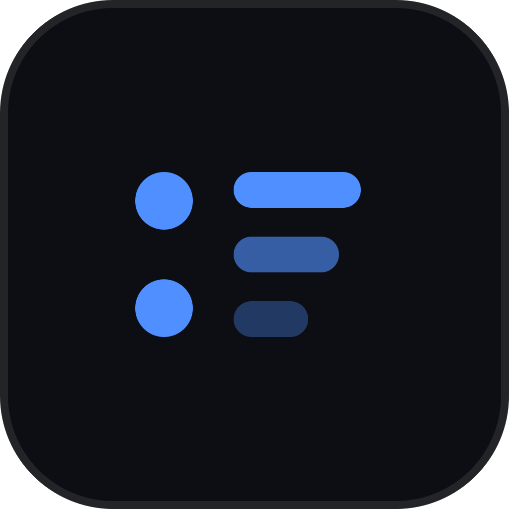
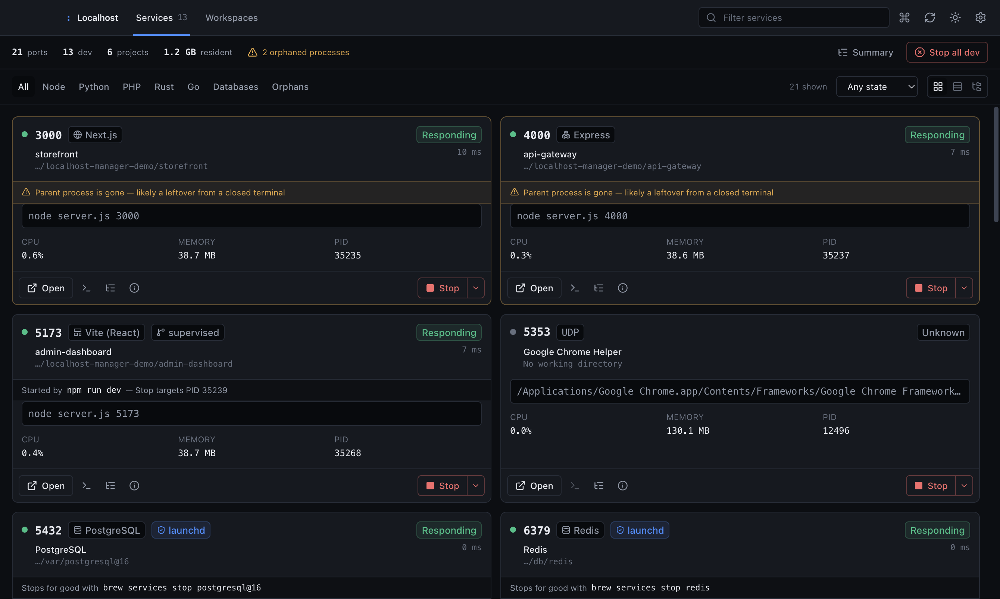
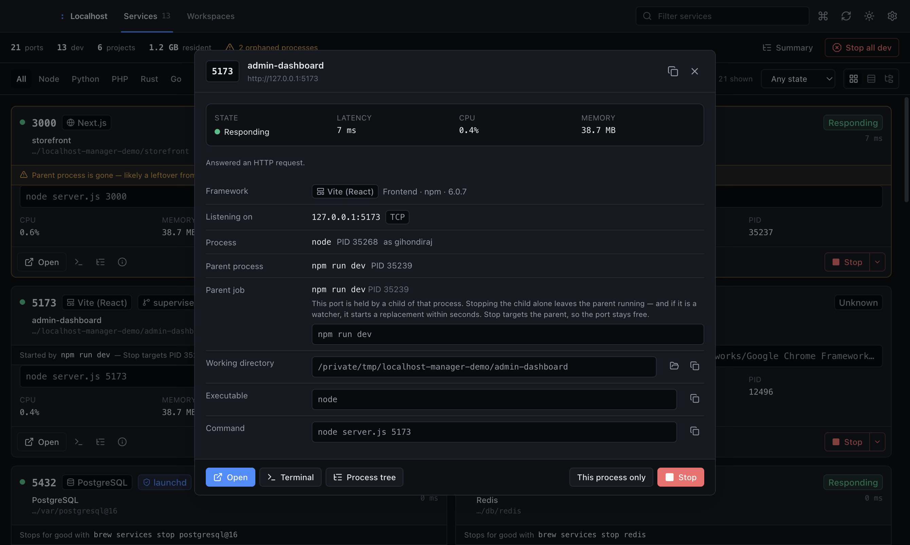
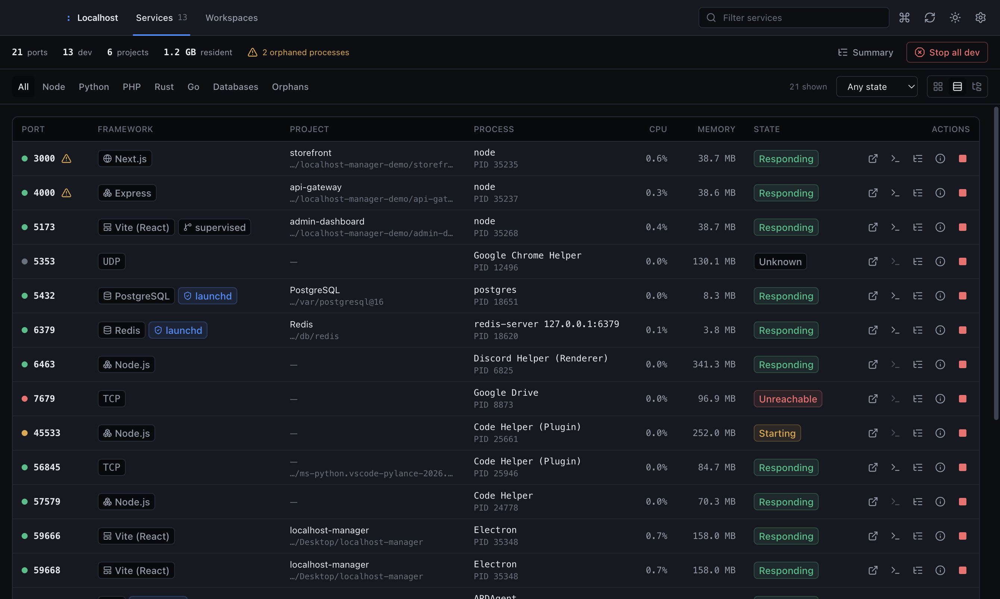
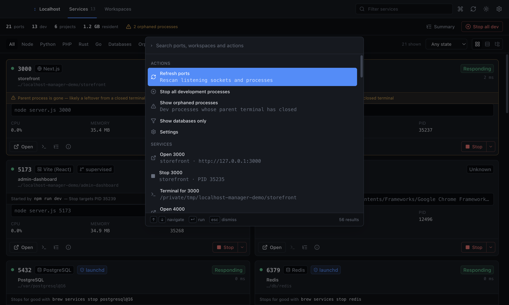
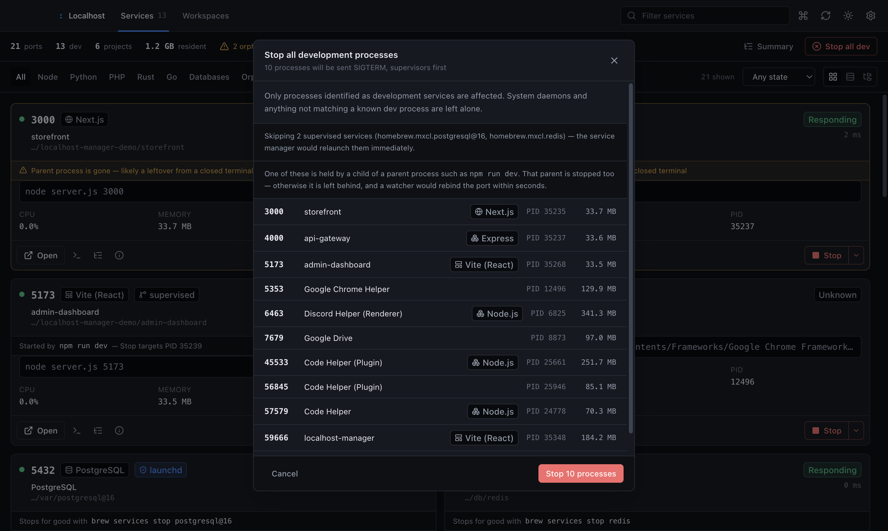

<div align="center">



# Localhost Manager

**See which ports are listening, what owns them, and stop them — for good.**

[](LICENSE)
[](#platform-support)
[](https://www.electronjs.org/)
[](https://react.dev/)
[](https://www.typescriptlang.org/)
[](#security-model)

</div>

---

A desktop app that shows every port listening on your machine, which process owns it, and
which project that process belongs to — then lets you inspect, stop, or restart it.

Electron + React 19 + Vite + TypeScript + Tailwind. Entirely local: no telemetry, no
accounts, no network requests of any kind.



## The problem

`lsof -i -P | grep LISTEN` tells you a port is busy. It does not tell you which of your
projects is holding it, what command started it, whether the server behind it is actually
responding, or whether it is a leftover from a terminal you closed two hours ago.

And when you do find the PID and kill it, it often comes straight back.

## Stops that stick

The process holding a port is frequently not the process that owns it.

```
php artisan serve          ← the supervisor: restarts the server whenever it exits
└── php -S 127.0.0.1:8003  ← the PID lsof reports
```

`php artisan serve` runs the built-in server as a child and starts a replacement the
moment that child exits — on the *next* port, if the old one has not been released yet.
Kill the PID you were given and the port comes back seconds later, one number higher.
`nodemon`, `cargo watch`, `flask --reload` and `air` behave the same way: they exist
precisely to respawn. A plain `npm run dev` does not restart anything, but killing past it
still leaves the wrapper behind — and whatever *it* wraps is usually a watcher.

So a stop has to walk **up** the parent chain to the top of the job, not just down the
child chain from the port holder. The hard part is knowing where to stop walking — one
step too far and you have killed the user's shell, their terminal, or their editor.

Localhost Manager fences the walk structurally. On POSIX a shell puts every job it starts
into its own **process group**, so sharing a process group id with the port holder *is*
membership in that job, and the shell itself sits outside it. The walk additionally
refuses to cross interactive shells, terminal emulators, editors hosting integrated
terminals, container runtimes, service managers, and the app's own process — and stops at
`init`. Windows has no process groups, so there a parent must positively look like a
supervisor before the kill is widened.

Where possible the job is then signalled as a **process group**, which is atomic: the
supervisor cannot notice a dead child and start a replacement, because it receives the
same signal in the same instant. Where that is not available the sweep runs root-first,
for the same reason. `SIGTERM` is a request, so anything still alive after the grace
period is escalated to `SIGKILL`.

The card tells you what it is about to do, rather than silently killing more than you
asked for:

> Started by `php artisan serve` — Stop targets PID 25151

If you genuinely want the narrow behaviour, **Stop this process only** is in the menu, and
it is honest about the consequence.

The inspector spells out the whole chain — the port holder, its parent, and what Stop will
actually target:



## What it does

**Port and process discovery.** TCP and UDP listeners across IPv4 and IPv6, with PID,
executable path, full command line, parent process, user, CPU, and resident memory.

**Project and framework detection.** Resolves each listening process's working directory
and inspects it for project markers — `package.json`, `go.mod`, `Cargo.toml`,
`pyproject.toml`, `composer.json`, `Gemfile`, `pom.xml`, and others. Recognises Next.js,
Nuxt, Astro, Remix, Svelte, Angular, Vite, NestJS, Express, Fastify, Hono, React, Vue,
Django, FastAPI, Flask, Laravel, Symfony, WordPress, Rust, Go, Spring Boot, Rails, Docker
Compose, and the common databases by port and process name. A directory is only named as a
project when it actually carries a marker.

**Health probing.** How a port is probed depends on what it can answer, so the result
means something:

| Port | Probe | Why |
|---|---|---|
| HTTP services | `GET /` | The only way to learn whether a web server actually responds |
| Databases | TCP connect | Sending HTTP to Postgres logs a protocol error on every poll |
| UDP listeners | not probed | A UDP listener does not accept TCP, so probing reports a false failure |

Results are reported as one of four states:

| State | Meaning |
|---|---|
| Responding | Answered an HTTP request, or accepted a TCP connection |
| Starting | Accepted the connection but has not answered yet — typical mid-build |
| Unreachable | Port is held open but refused the connection |
| Unknown | Not probed, or the probe was inconclusive |

**Orphan detection.** Flags development processes reparented to `launchd`, `init`,
`systemd`, or `explorer.exe` — the signature of a server whose terminal is gone.

**Service-manager awareness.** A process supervised by launchd, systemd, or Windows
Services is *not* an orphan — the service manager is its intended parent, and stopping it
only makes it respawn. Those services are labelled with the manager and the job name, and
where the command can be inferred the app shows what actually stops them, e.g.
`brew services stop redis`. They are excluded from *Stop all dev* rather than counted as
stops that did not stick.

The app deliberately offers no stop command for the operating system's own jobs
(`com.apple.*`, system-slice systemd units) — printing a bootout command next to
ControlCenter would be inviting you to break your machine.

**Stopping things.** Supervision-aware job termination, as described above: graceful
`SIGTERM` with `SIGKILL` escalation, process-group delivery where the job leads its own
group, and a root-first sweep everywhere else. A stop reports success only when the
process is actually gone. *Stop all dev* applies this to every detected development
process, counts jobs rather than PIDs, and leaves system daemons alone.

**Workspaces.** Group the commands a project needs — dev server, worker, database — so
they start and stop together, with port-conflict pre-checks and live `stdout`/`stderr`
streaming.

**Command palette.** `⌘K` to jump to any port or run any action.

### Views

Cards, a dense table, or grouped by project — the same data at three levels of detail.





*Stop all dev* counts jobs rather than PIDs, and says up front what it is skipping and
why:



## Keyboard shortcuts

| Shortcut | Action |
|---|---|
| `⌘K` / `Ctrl+K` | Command palette |
| `⌘⇧P` / `Ctrl+Shift+P` | Command palette |
| `⌘R` / `Ctrl+R` | Rescan ports |
| `Escape` | Dismiss the topmost dialog |

## Architecture

```
src/
├── main/                            # Electron main process
│   ├── index.ts                     # entrypoint, window, tray
│   ├── ipc/index.ts                 # IPC handlers, argument validation
│   ├── platform/
│   │   ├── PlatformAdapter.ts       # the OS-facing interface
│   │   ├── supervision.ts           # which PID a stop should target (pure, unit-tested)
│   │   ├── posixTermination.ts      # signalling a job; shared by macOS and Linux
│   │   ├── macos/                   # lsof + ps
│   │   ├── linux/                   # ss + /proc
│   │   └── windows/                 # netstat + PowerShell CIM
│   └── services/
│       ├── PortService.ts           # aggregation and polling
│       ├── ProcessService.ts        # classification, job termination
│       ├── ProjectService.ts        # project and framework heuristics
│       ├── HealthService.ts         # probing with a short cache
│       ├── WorkspaceService.ts      # multi-command orchestration
│       ├── LogService.ts            # bounded log ring buffer
│       └── ConfigService.ts         # persisted settings, emits changes
├── preload/index.ts                 # the entire contextBridge surface
├── renderer/src/
│   ├── ui/                          # design-system primitives
│   ├── components/                  # feature components
│   ├── hooks/                       # useServices, useWorkspaces, useTheme
│   └── index.css                    # theme tokens
└── shared/types/                    # types used by both processes

assets/                              # runtime assets (tray template icons)
build/                               # packaging resources (app icon, entitlements)
```

`PortService` polls, joins raw port entries against the process table, enriches each with
project detection, supervisor resolution, and a health probe, then emits
`services-updated`. The renderer never polls; it subscribes.

Supervisor resolution is deliberately a **pure function over the process table**
([`supervision.ts`](src/main/platform/supervision.ts)). The table is already in memory
from the same scan, so annotating every port costs nothing extra, and the fencing rules —
the part where a bug means killing someone's editor — are testable without spawning
anything.

### Design system

Components name a **role**, never a hue — `surface`, `line`, `ink`, `muted`, `accent`,
`ok`, `warn`, `danger`. Roles are CSS custom properties defined once per theme in
[`index.css`](src/renderer/src/index.css) and exposed to Tailwind in
[`tailwind.config.js`](tailwind.config.js), so light and dark are one source of truth and
there is not a single `dark:` variant in the codebase. Colour is reserved for service
state; structure is neutral. All token pairs meet WCAG AA at the sizes they are used.

Shared primitives live in [`src/renderer/src/ui/`](src/renderer/src/ui/) — `Button`,
`Badge`, `Modal`, `Menu`, form controls, `HealthBadge`. Feature components compose them
rather than writing their own class strings.

### Security model

* `contextIsolation: true`, `nodeIntegration: false`
* A Content Security Policy that permits no network origin, no inline scripts, and no
  remote fonts — the app renders identically offline
* IPC arguments validated in the main process
* Processes spawned directly, without shell interpolation of user input
* A kill never walks into the app's own process ancestry, whatever the process table says
* `setWindowOpenHandler` denies every in-app window; links go to the real browser
* A single-instance lock, so two copies cannot both poll and fight over the tray
* `npm audit` reports zero vulnerabilities; Electron is kept current because the renderer
  is a browser engine and its CVEs are the app's CVEs

### Resilience

* A React error boundary keeps a render fault from blanking the window — port monitoring
  continues in the main process, and the panel offers a reload
* Failed scans are reported to the UI instead of leaving a stale list that looks like an
  idle machine
* `unhandledRejection` and `uncaughtException` are logged rather than killing the process

## Platform support

macOS is the most thoroughly exercised path. Linux uses `ss` and `/proc` and reads working
directories from `/proc/<pid>/cwd`.

On Windows a process's working directory is not readable without injecting into it, so
project detection there falls back to the executable's directory. Windows also has no
process groups and can report a parent PID that has since been recycled, so the
supervisor walk there requires the parent's command line to positively look like a
supervisor before it will widen a kill — a narrower rule than the POSIX one, chosen
because the failure mode of guessing wrong is killing the wrong process.

## Development

Requires Node.js >= 18 and npm >= 9.

```bash
npm install
npm run dev      # Vite dev server + Electron
npm run lint     # typechecks renderer AND main (two tsconfigs)
npm test         # unit tests
npm run build    # lint, then production bundle
```

`npm run lint` covers both TypeScript projects: `tsconfig.json` for the renderer, shared
types, and preload; `tsconfig.electron.json` for the main process. Both run with
`noUnusedLocals`. The production build runs `lint` first, because esbuild strips types
without checking them.

`npm test` bundles and runs every `tests/*.test.ts`; adding a file needs no script change.
Tests never read or write the real `~/.localhost-manager/` — `ConfigService` takes an
injectable directory and the suite passes a temporary one.

The suite includes two tests that spawn a **real respawning supervisor** — a detached
script that restarts an HTTP server whenever it dies. One asserts that killing only the
port holder brings the port back under a new PID, which is the bug the supervisor walk
exists to fix; the other asserts that stopping through the adapter takes the supervisor
with it and the port stays free. Both clean up their process group whatever the outcome.

Settings and workspaces are stored in `~/.localhost-manager/`.

### Packaging

```bash
npm run dist:dir     # package without installers — fastest way to verify config
npm run dist:mac     # dmg + zip, arm64 and x64
npm run dist:win     # nsis installer
npm run dist:linux   # AppImage + deb
```

Output lands in `release/`. The app icon is generated from
[`build/icon.svg`](build/icon.svg); macOS entitlements are in
[`build/entitlements.mac.plist`](build/entitlements.mac.plist) and grant what the app
genuinely needs — spawning `lsof`/`ps`, reading project directories, and probing
`127.0.0.1`.

**Code signing is not configured**, because it requires your own certificates. Without
them macOS builds are unsigned and Gatekeeper will warn on first launch. To sign and
notarise, set `CSC_LINK`/`CSC_KEY_PASSWORD` and `APPLE_ID`/`APPLE_APP_SPECIFIC_PASSWORD`
/`APPLE_TEAM_ID` in the environment; the `hardenedRuntime` and entitlements config is
already in place.

## License

MIT © GDP07
